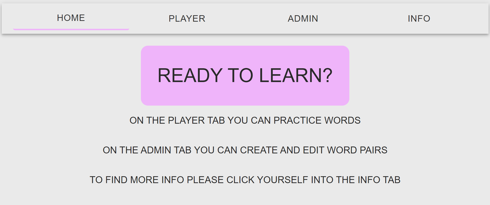
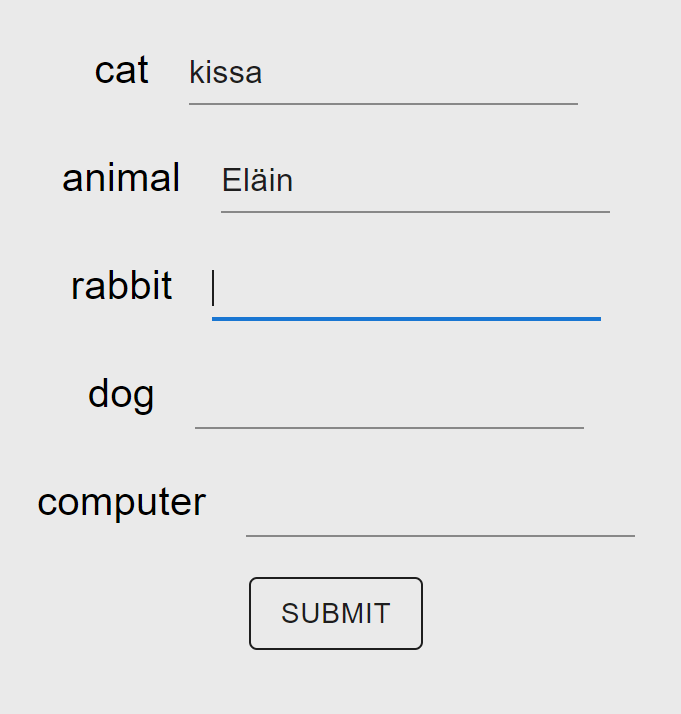
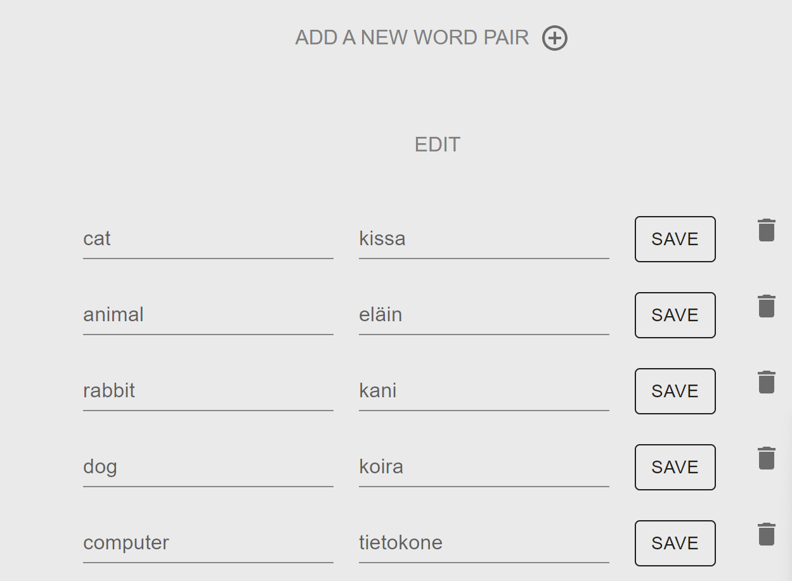

# Learn-language-app
An application that can be used to train foreign language. The end user is prompted with foreign language words and user must write the correct translation.
Ability to add, edit and delete word pairs.

# URL to cloud
https://annas-learn-language.onrender.com/

# Motivation
Final assignment of backend course.

# Screenshots

# Tech/framework used
react, node, mysql

docker, material.ui

# Installation
1. Clone the repository from Github onto your local machine.
    1. Go to the repository page on GitHub that you want to clone.
    2. Click on the green "Code" button located towards the top right of the page.
    3. Select "HTTPS" if it's not already selected.
    4. Copy the URL for the repository.
    5. Open your terminal or command prompt on your local machine.
    6. Navigate to the directory where you want to clone the repository.
    7. Type "git clone " and then paste the URL you copied in step 4. It should look something like this: 
    git clone https://github.com/username/repository.git
    8. Press Enter to run the command.
    9. Git will clone the repository to your local machine. Once it's finished, you can navigate into the repository directory and start working with the code.

2. Navigate to the root directory of the cloned repository in your terminal or command prompt.

3. Install the required things by running the command "npm run install-all"

4. Start the app by running the command "npm run start".

5. Go to http://localhost:5174/

# Tests
GET http://localhost:8080/api/words

POST http://localhost:8080/api/words
Content-Type: application/json
{"word1": "dog", "word2": "koira"}

DELETE http://localhost:8080/api/words/3

PUT http://localhost:8080/api/words/4
Content-Type: application/json
{"word1": "cat", "word2": "kissa"}

# Author
Anna Kulovuori (https://github.com/annakulovuori)
